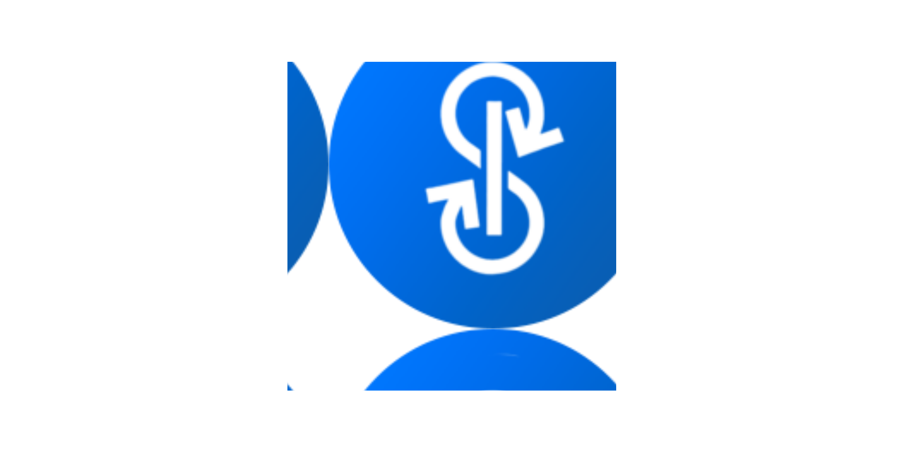

<!-- SPDX-License-Identifier: MIT -->

<p align="center">
 
	<h2 align="center">YFI README</h2>
	<p align="center"> *Sub title header* </p>
</p>
<p align="center">
	<a href="https://github.com/anuraghazra/github-readme-stats/actions">
		
	</a>
	<a href="https://codecov.io/gh/anuraghazra/github-readme-stats">
		
	</a>
	<a href="https://github.com/anuraghazra/github-readme-stats/issues">
		
	</a>
	<a href="https://github.com/anuraghazra/github-readme-stats/pulls">
		
	</a>
	<br />
	<br />
	<a href="https://a.paddle.com/v2/click/16413/119403?link=1227">
		
	</a>
	<a href="https://a.paddle.com/v2/click/16413/119403?link=2345">
		
	</a>
</p>

<p align="center">
	<a href="${VIEW_DOCS}">View Documentation</a>
	·
	<a href="${REPORT_BUG}">Report Bug</a>
	·
	<a href="${REPORT_SECURITY}">Security Contact</a>
</p>
<p align="center">
	<a href="/docs/readme_fr.md">Français </a>
	·
	<a href="/docs/readme_cn.md">简体中文</a>
	·
	<a href="/docs/readme_es.md">Español</a>
	·
	<a href="/docs/readme_de.md">Deutsch</a>
	·
	<a href="/docs/readme_ja.md">日本語</a>
	·
	<a href="/docs/readme_pt-BR.md">Português Brasileiro</a>
	·
	<a href="/docs/readme_it.md">Italiano</a>
	·
	<a href="/docs/readme_kr.md">한국어</a>
</p>
</p>
<p align="center">Loved the project? Please consider <a href="https://www.paypal.me/anuraghazra">donating</a> to help it

| **v3**   | **Yield Tokens**                           |
|----------|--------------------------------------------|
| Contract | Address                                    |
| yDAIv3   | 0xC2cB1040220768554cf699b0d863A3cd4324ce32 |
| yUSDCv3  | 0x26EA744E5B887E5205727f55dFBE8685e3b21951 |
| yUSDTv3  | 0xE6354ed5bC4b393a5Aad09f21c46E101e692d447 |
| yBUSDv3  | 0x04bC0Ab673d88aE9dbC9DA2380cB6B79C4BCa9aE |


```diff
-Status: Draft
+Status: Accepted
Version: 1
Created: 2017-05-06
-Last-Modified: 2020-04-26
+Last-Modified: 2020-05-10
```

## License

MIT
